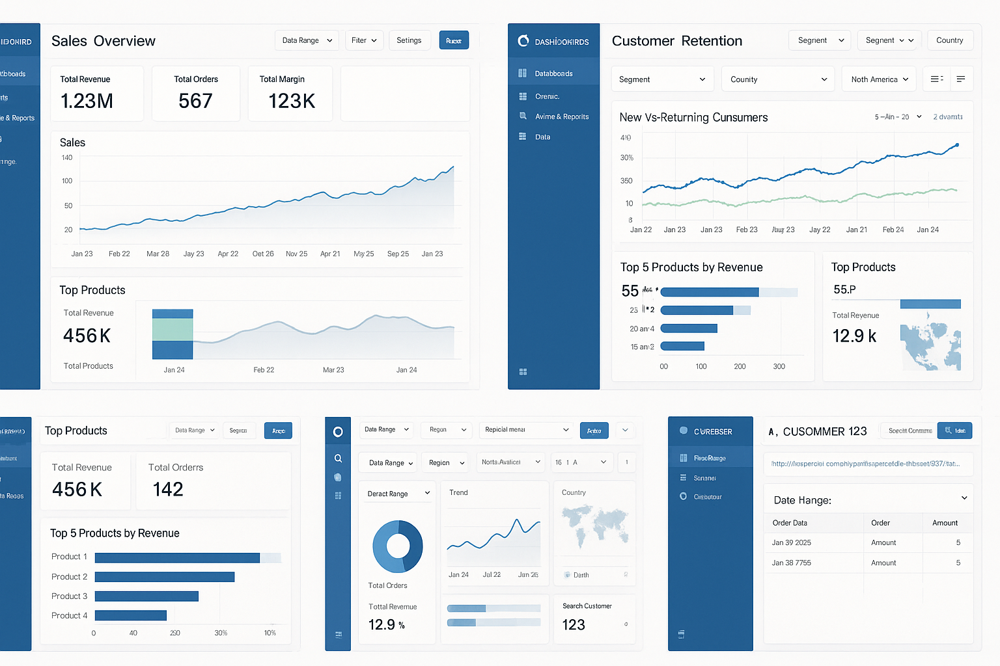

### Apache Superset Portfolio – Kalyan
This repository includes example dashboards, SQL queries, and Jinja templates that reflect the way I typically build analytics solutions using Superset in real-world projects.  
The dashboards shown here were recreated using dummy data but follow the same patterns and structure I’ve used in production.

## 📊 Dashboard Samples

Below is a combined snapshot of the dashboards I've built in Superset, including:

- **Sales Overview Dashboard**  
- **Customer Retention Analytics**  
- **Top Products Performance**  
- **Cross-filtering & Interactive Views**  
- **Customer Drilldown Dashboard**

All dashboards follow Superset v2 UI style with filters, KPIs, line charts, bar charts, cohort-style visuals, and drill-through capabilities.

### **Dashboard Preview**

## 🧩 SQL Logic Used in Dashboards

I frequently use advanced SQL features to support analytics dashboards:

### ✔ Window Functions
- `DENSE_RANK()` for ranking top products/customers  
- `LAG()` for MoM & YoY comparisons  
- `ROW_NUMBER()` for customer journeys  
- `PARTITION BY` for segmentation  

### ✔ KPI Calculations
- Revenue, Orders, Margin  
- Rolling averages (7, 30, 90 days)  
- Conversion funnel metrics  
- Customer lifecycle metrics  

SQL examples are included in the `/sql` directory.

## 🔧 Jinja Templating

To make dashboards dynamic and reusable, I use Jinja temp
