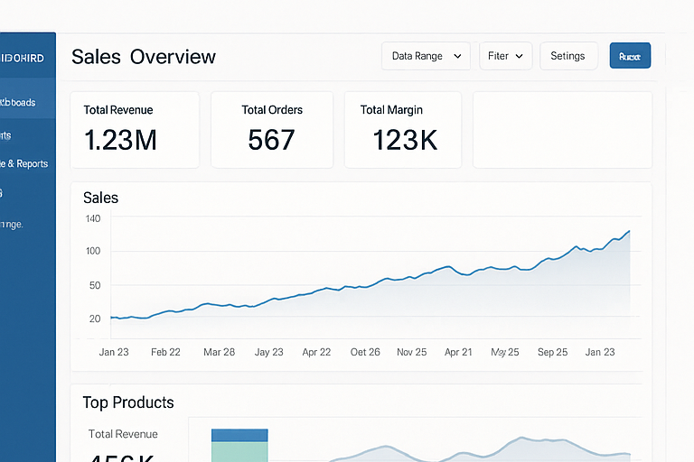
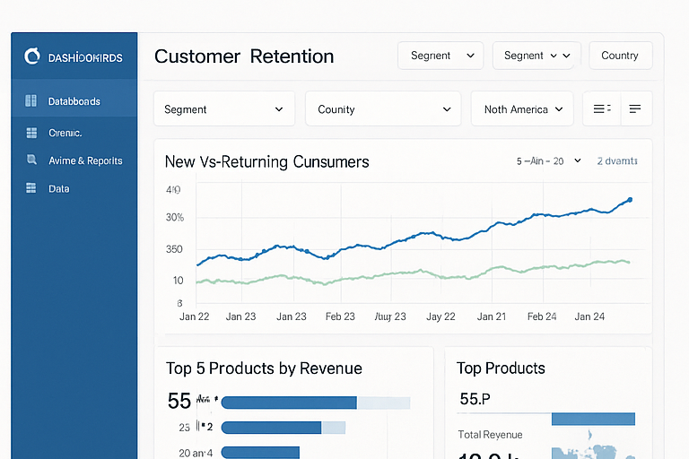
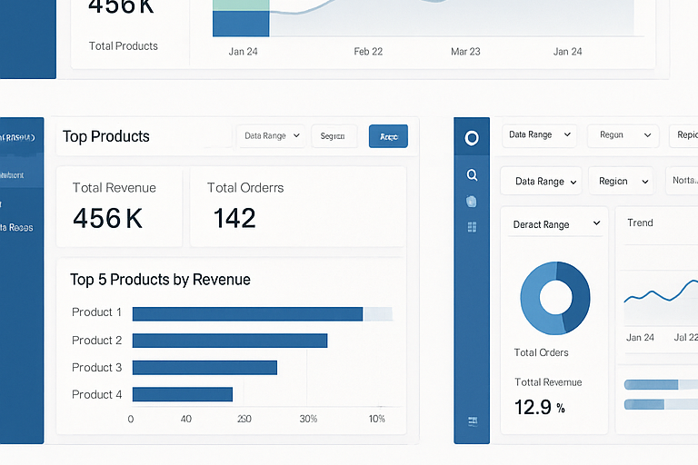
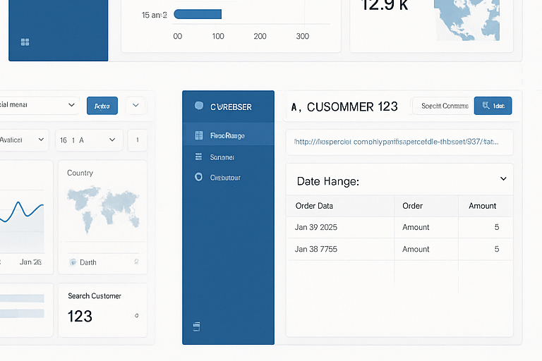

# Apache Superset Portfolio – Kalyan


This repository contains sample dashboards, SQL queries, and Jinja templates that represent how I typically design analytics solutions using Superset.  
The dashboards shown here were recreated using dummy data for demonstration purposes, but the design patterns, filters, metrics, and visual structure closely match my real project experience.

---

## 📊 Dashboard Samples

Below are four sample dashboards I built in Superset (v2 UI).  
These demonstrate KPIs, time-series analytics, drilldowns, cross-filters, and product performance insights.

### **1. Sales Overview Dashboard**


---

### **2. Customer Retention Dashboard**


---

### **3. Top Products Dashboard**


---

### **4. Customer Drilldown Dashboard**


---

## 🧠 Key Capabilities Demonstrated

### ✔ KPI Design  
- Revenue, Orders, Margin  
- Rolling weekly/monthly averages  
- Product and segment-level metrics  

### ✔ Advanced SQL  
- Window functions (`DENSE_RANK`, `ROW_NUMBER`, `LAG`)  
- Cohort-style month-over-month trends  
- Ranking and segmentation logic  
- Time-series breakdowns  

### ✔ Jinja Templating  
Used to make dashboards dynamic and reusable:

```jinja2
WHERE order_date BETWEEN '{{ start_date }}' AND '{{ end_date }}'


  AND region = '{{ region }}'


LIMIT {{ top_n | default(10) }}
